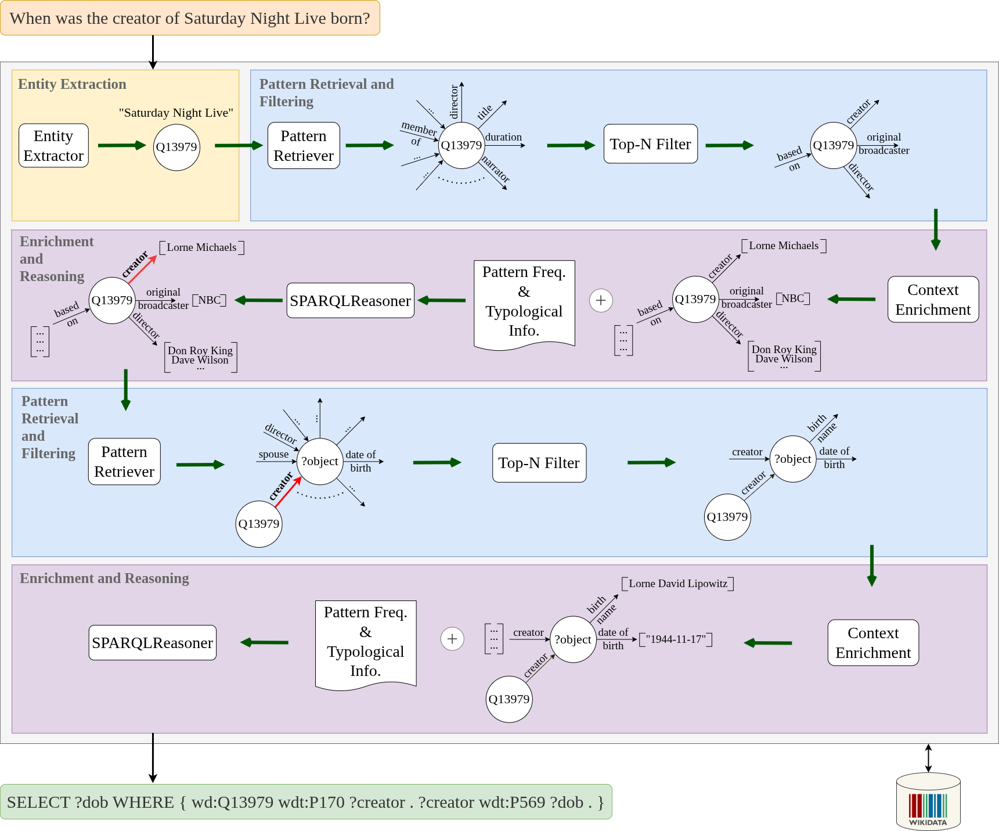

# MARS: Multi-hop Retrieval-Augmented SPARQL Generation for Multilingual KGQA

A semantic-parsing based KGQA system that generates ([Wikidata](https://www.wikidata.org/)) SPARQL for a given natural language query.


<figure style="display:block; margin:2rem auto; text-align:center;">
  
  <figcaption style="margin-top:0.4rem; font-size:0.9rem; color:#666;">
    An overview of our MARS pipeline on an example question:
    <i>"When was the creator of Saturday Night Live born?"</i> (from the <a href="https://github.com/KGQA/QALD-10">QALD‑10</a> dataset).
  </figcaption>
</figure>

## Local Setup

### Prerequisites
Make sure you have Docker (<https://docs.docker.com/>) and Python (>=3.12.3) installed.

### Dependencies Installation
To install the dependencies, run:
```bash
bash setup/setup_venv.sh
```

This creates a python virtual environment, which will be used for the experiments.

### SPARQL Endpoint
MARS uses a [Tentris](https://tentris.io/) SPARQL endpoint for querying Wikidata. The Tentris server configuration and data loading scripts are available in [`wikidata_prep/tentris/`](wikidata_prep/tentris/).

### Wikidata Data Split
Since May 2025, the Wikidata Query Service has split its graph into a **main** graph and a **scholarly** graph ([details](https://www.wikidata.org/wiki/Wikidata:SPARQL_query_service/WDQS_graph_split)). MARS operates on the **main** split. Scripts to download the full Wikidata dump and extract the main split are provided in [`wikidata_prep/`](wikidata_prep/). See [`wikidata_prep/README.md`](wikidata_prep/README.md) for instructions.

### Wikidata Relations Indexing
We pre‑index the URIs and labels of Wikidata relations for quicker access. To run the process, simply execute the script below:
```bash
python -m src.cache.wikidata_relation_info_extractor
```

### LLM Management
MARS utilizes local LLM instances served via a [*llama.cpp*](https://github.com/ggml-org/llama.cpp) server, managed through [`setup/llama_server_control.sh`](setup/llama_server_control.sh).

The server expects the model weights to be located in the directory referenced by the `$LLAMA_CACHE` environment variable. Make sure this variable points to a valid directory **before** you start downloading any models.

#### Recommended download method

1. Install the `llama-cli` tool (instructions are in the [llama.cpp README](https://github.com/ggml-org/llama.cpp?tab=readme-ov-file#llama-cli)).
2. Use `llama-cli` to fetch the models you need, for example:

```bash
llama-cli -hf nomic-ai/nomic-embed-text-v2-moe-GGUF:F16
llama-cli -hf unsloth/gpt-oss-120b-GGUF:Q8_0
```

#### Starting the server

```bash
bash setup/llama_server_control.sh start
```

By default the server starts on port `9292`. To use a different port:

```bash
bash setup/llama_server_control.sh start 9393
```

Other useful commands:

```bash
bash setup/llama_server_control.sh stop 9292
bash setup/llama_server_control.sh restart 9292
```

#### Which models are required?

The complete list of configured models is defined in [`setup/llama_server_models.ini`](setup/llama_server_models.ini). You don't have to download every entry, only the models you plan to use.

## Running Experiments

> **Note**: Entity annotations in the QALD-formatted dataset files (e.g., [tentrisq10_aug_gold.json](data_dir/processed_kgqa_ds/qald10/test/tentrisq10_aug_gold.json)) are generated using the [GRASP entity linking pipeline](https://github.com/dice-group/grasp_el). See the [annotation pipeline documentation](https://github.com/dice-group/grasp_el/blob/main/ANNOTATION_PIPELINE.md) for details on how to annotate questions with entity and property links.
>
> We have also experimented with an alternative entity linking approach called `t5_aug`, which uses LLM-augmented text for annotation with a fine-tuned T5 model. This is not actively used, but the code can be found at [`t5_aug.entity_linking_tool`](t5_aug.entity_linking_tool).

Here's a sample command to run MARS pipeline for QALD10 dataset:
```bash
bash execute_experiment.sh --gpu 0 --approach PBSG_MHOP \
    --dataset QALD10_UPDATED_TENTRISQ10 --split TEST --llm GPTOSS120B \
    --topn-count 20 --mhop-limit 5 --include-pattern-count \
    --use-aug-similarity --language en --conc-ex-limit 2 --use-class-info
```

For SLURM-based setup, look into the scripts provided in: [`slurm/`](slurm/).

## Resources

Links to all the available resources and analyses can be found in markdown files inside [`supplementary_material/`](supplementary_material/) directory.